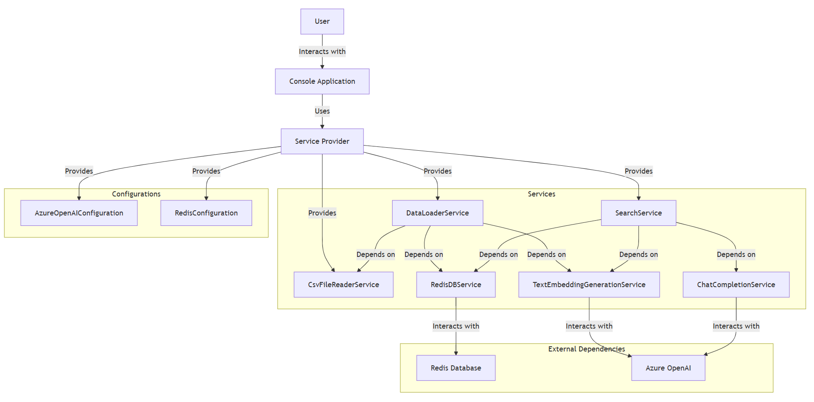
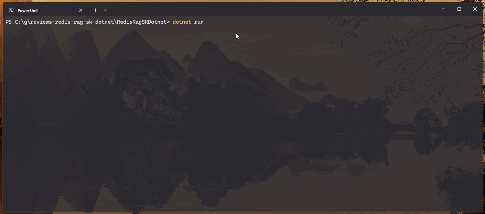

# Redis Reviews

## About

This project is a sample application designed to showcase how easy it is to develop a Generative AI (GenAI) application using Azure OpenAI, Azure Cache for Redis, and the Semantic Kernel .NET package. The application demonstrates the integration of these powerful technologies to vectorize and search product reviews. By leveraging Azure OpenAI for natural language processing and Redis for fast data storage and retrieval, this sample provides a practical example of building intelligent applications with advanced AI capabilities. Additionally, the project showcases the Retrieval-Augmented Generation (RAG) pattern, using Redis as both a data store and a vector storage solution to enhance the search and retrieval of relevant information.

## Architecture


## Prerequisites

- .NET 9 SDK
- Azure OpenAI account
- Redis instance

## Configuration

The application requires the following configuration values:

- Azure OpenAI Endpoint
- Azure OpenAI API Key
- Azure OpenAI Embedding Model Deployment Name
- Azure OpenAI Chat Completion Model Deployment Name
- Redis Host
- Redis Port
- Redis Password

These values should be set in the user secrets for the project.

### Setting User Secrets

#### Visual Studio

1. Right-click on your project in Visual Studio and select "Manage User Secrets".
2. Add the following JSON to the `secrets.json` file:

```json
{ 
	"AzureOpenAI:Endpoint": "your-endpoint", 
	"AzureOpenAI:Key": "your-api-key", 
	"AzureOpenAI:EmbeddingDeployment": "your-embedding-deployment", 
	"AzureOpenAI:CompletionsDeployment": "your-completions-deployment",
	"Redis:Host": "your-redis-host", 
	"Redis:Port": "your-redis-port", 
	"Redis:Password": "your-redis-password" 
}
```

#### .NET CLI

1. Open a terminal and navigate to your project directory.
2. Run the following commands to set the user secrets:

```
dotnet user-secrets set "AzureOpenAI:Endpoint" "your-endpoint" 
dotnet user-secrets set "AzureOpenAI:Key" "your-api-key" 
dotnet user-secrets set "AzureOpenAI:EmbeddingDeployment" "your-embedding-deployment" 
dotnet user-secrets set "AzureOpenAI:CompletionsDeployment" "your-completions-deployment" 
dotnet user-secrets set "Redis:Host" "your-redis-host" 
dotnet user-secrets set "Redis:Port" "your-redis-port" 
dotnet user-secrets set "Redis:Password" "your-redis-password"
```

## Running the Application

1. Clone the repository.
2. Open the solution in Visual Studio.
3. Ensure that the user secrets are set as described above.
4. Build and run the application.

## Usage

When you run the application, you will see a menu with the following options:

1. Vectorize the review(s) and store it in Redis
2. Ask AI Assistant (search for a review by asking a question)
3. Exit this Application

### Vectorize Reviews

Select the first option to read reviews from a CSV file located in the `assets` directory with the file name `reviews.csv`, vectorize them using Azure OpenAI, and store them in Redis.

### Search Reviews

Select the second option to ask a question and search for reviews based on the query. The application will use Azure OpenAI to generate embeddings for the query and perform a vector search in Redis.


## Demo




## Running Redis Locally

You can run Redis locally using the `redis-stack` Docker image. Follow these steps to spin up a Redis container:

1. Ensure you have Docker installed on your machine.
2. Open a terminal and run the following command to pull the `redis-stack` image:
```
docker pull redis/redis-stack:latest
```

3. Run the Redis container with the following command:
```
docker run -d --name redis-stack -p 6379:6379 -p 8001:8001 redis/redis-stack:latest
```

This command will start a Redis container with the default Redis port (6379) and the RedisInsight port (8001) exposed.


## License

This project is licensed under the MIT License.
